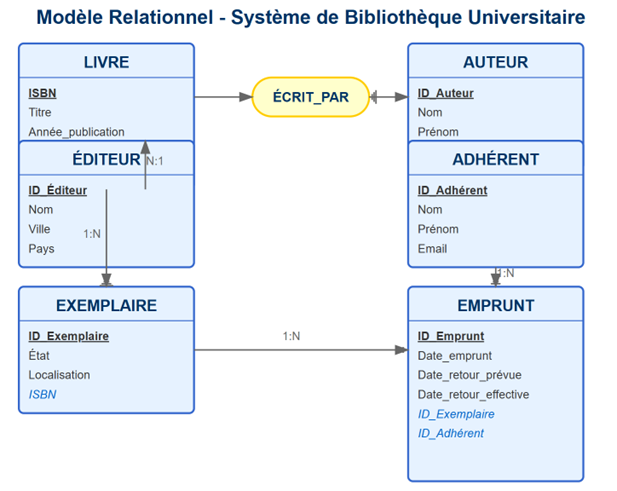
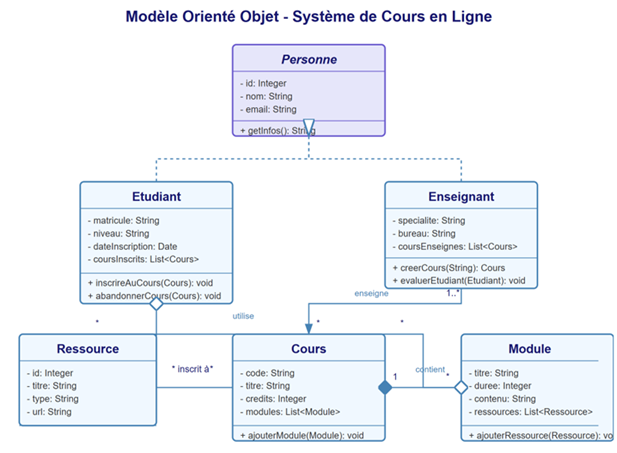
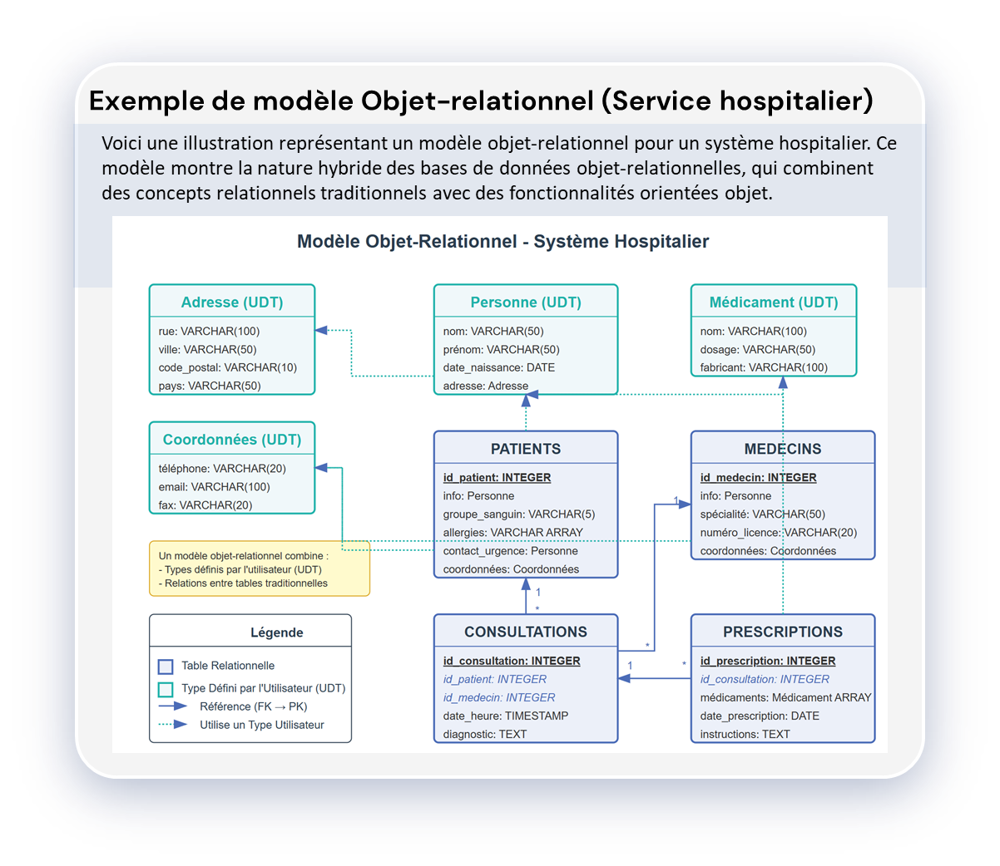

# ❓ C'est quoi un modèles de donnée ?   

💡 **En informatique, un modèle de données est un modèle qui décrit la manière dont sont représentées les données dans une organisation métier, un système d'information ou une base de données.**

Dans notre cas en SQL, il en existe plusieurs : 
- Modèle relationnel
- Modèle objet
- Modèle objet-relationnel  

# 🗄️ Le modèle relationnel 
💡 **Le modèle relationnel, introduit par Edgar F. Codd en 1970, est le modèle le plus utilisé pour les bases de données.**

## 📏 Propriétés fondamentales 
- Atomicité des données
- Structure tabulaire
- Relations entre tables
- Contraintes d'intégrité  

## 🔑 Concepts clés 

- Relation(Table) : Une structure théorique qui représente un ensemble de données. Chaque relation a la même structure (les mêmes colonnes) 
 
    - Exemple : Une table ``Client`` avec les colonnes ``ID``, ``Nom`` et ``Email``.   

- Tuple(Ligne) : Un enregistrement unique dans la table. Chaque tuple respecte la stucture de la relation
    - Exemple : ```(1, "Alice", "alice@mail.com")``` est un tuple de la table ``Client``
  
- Attribut(Colonne) : Une propriété ou un champ d'une relation. Cela décrit le type d'une données stocké. 
    - Exemple : ``Nom`` ou ``Email`` sont des attributs de la table ``Client``  


- Domaine : Ensemble de valeurs possibles pour un attribut
- Clé primaire : Attribut(s) identifiant de manière unique chaque tuple
- Clé étrangère : Attribut(s) faisant référence à une clé primaire d'une autre relation


## Exemple de modèle relationnel 

Voici une illustration d'un modèle relationnel pour un système de gestion de bibliothèque universitaire. Ce diagramme représente les entités principales et leurs relations dans une base de données relationnelle.  


  

💡 **Les relations entre les entités sont représentées par les connecteurs, avec des indications de cardinalité (1,N) et des "crow's feet" (pattes de corbeau) qui illustrent les relations multiples.**

### 📊 Informations sur les tables 
Livre : Stocke les informations essentielles sur les livres (ISBN, titre, année de publication, etc.)  

Auteur : Contient les données des auteurs des livres

Éditeur : Enregistre les informations sur les maisons d'édition  

Adhérent : Stocke les informations des utilisateurs de la bibliothèque  

Exemplaire : Représente le stock des livres disponibles  

Emprunt : Enregistre les transactions de prêt  

### ⚙️ Caractéristiques notables du modèle :
- Les clés primaires sont soulignées (ex: ``ISBN``, ``ID_Auteur``)
- Les clés étrangères sont en italique et en bleu (ex: ``ID_Éditeur`` dans ``Livre``)
- Une relation N entre ``Livre`` et ``Auteur`` est modélisée par l'entité d'association ``ÉCRIT_PAR``
- Un livre peut avoir plusieurs exemplaires (relation 1)
- Un adhérent peut faire plusieurs emprunts (relation 1)

💡 **Ce type de diagramme est généralement utilisé dans la conception de bases de données relationnelles pour visualiser la structure et les relations entre les différentes tables avant leur implémentation en SQL.**

# 🧩 Le modèle objet 
💡 **Le modèle objet applique les principes de la programmation orientée objet au stockage des données.**  

## ⚙️ Caractéristiques
- Encapsulation des données et des méthodes
- Héritage et polymorphisme
- Classes et instances
- Relations entre objets (association, agrégation, composition)  

## ✅ Avantages
- Cohérence avec les langages de programmation orientés objet
- Modélisation plus naturelle des entités complexes
- Meilleure gestion des types de données complexes

## ⚠️ Inconvénients  
- Complexité accrue
- Performance parfois inférieure aux systèmes relationnels
- Standardisation moins mature  

## Exemple de modèle orienté objet

Voici une illustration représentant un modèle orienté objet pour un système de gestion de cours en ligne. Contrairement au modèle relationnel précédent, ce diagramme de classes UML met en évidence les concepts spécifiques à la programmation orientée objet.  

  

### ⚙️ Caractéristiques du modèle orienté objet illustré  

#### 🌳 Classes et hiérarchie d'héritage
- ``Personne`` (classe abstraite) : Contient les attributs et méthodes communs à tous les types de personnes
- ``Étudiant`` et ``Enseignant`` : Héritent de la classe ``Personne``, démontrant le concept d'héritage

#### 📦 Encapsulation
- Les attributs sont marqués avec "-" pour indiquer qu'ils sont privés
- Les méthodes sont marquées avec "+" pour indiquer qu'elles sont publiques  
  
#### 🔗 Relations entre classes
- Héritage : Représenté par des flèches en pointillés avec une tête triangulaire vide (``Étudiant`` et ``Enseignant`` héritent de ``Personne``)
- Agrégation : Symbolisée par un losange vide (les étudiants sont inscrits à des cours, les modules utilisent des ressources)
- Composition : Marquée par un losange plein (les cours contiennent des modules)
- Association : Montrée par une flèche simple (les enseignants enseignent des cours)  


#### ➗ Multiplicité
Les cardinalités sont indiquées près des flèches de relation (1..*, *, etc.)

**Ce modèle orienté objet se concentre sur les comportements et les responsabilités des objets, contrairement au modèle relationnel qui se concentre sur la structure des données et leurs relations. On peut voir que ce modèle capture bien les concepts comme l'héritage, l'encapsulation, et les différents types de relations entre objets, qui sont caractéristiques des bases de données orientées objet.**

💡 **Dans une vraie implémentation de base de données orientée objet, les objets seraient stockés directement avec leur structure et leurs comportements, plutôt que d'être décomposés en tables comme dans un modèle relationnel.**


# 🔄 Le modèle objet-relationnel  
Une combinaison des modèles relationnel et objet, permettant :
- Structure tabulaire avec relations
- Types de données complexes
- Héritage
- Méthodes associées aux types de données


## Exemple de modèle objet-relationnel   

Voici une illustration représentant un modèle objet-relationnel pour un système hospitalier. Ce modèle montre la nature hybride des bases de données objet-relationnelles, qui combinent des concepts relationnels traditionnels avec des fonctionnalités orientées objet.




### ⚙️ Principales caractéristiques 
- ``Adresse`` : Stocke les informations essentielles sur les adresses (rue, ville, code_postal, pays.)
- ``Coordonnées`` : Stocke toutes les informations de contact. 
- ``Personne`` : Stocke toutes les informations liées à la personne et inclut les informations de l'``Adresse``
- ``Médicament`` : Stocke toutes les informations sur les médicaments
- ``Patients`` : Contient les informations du patient en incluant ``Personne`` et ``Coordonnées``. 
- ``Médecin`` : Contient les informations du médecin en incluant ``Personne`` et ``Coordonnées``. 
- ``Consultations`` : Contient les informations sur les consultations. Table relationnelle classique avec clés étrangères
- ``Prescription`` : Contient un tableau (Médicament ARRAY) ainsi que les dates et des instructions. 
- Collections complexes : Utilisation d'arrays de types simples (VARCHAR ARRAY) ou complexes (Médicament ARRAY)  

- Relations traditionnelles : Les tables conservent des relations par clés étrangères comme dans un modèle relationnel


