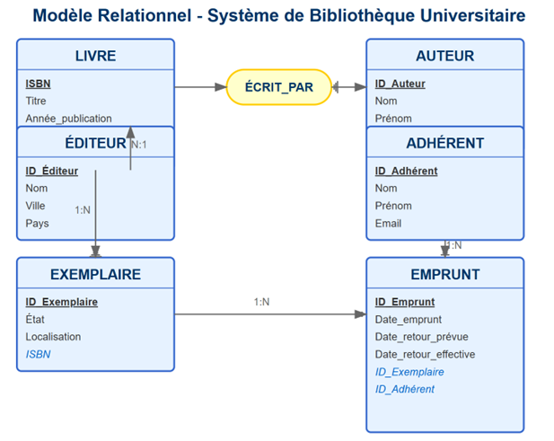

# ❓ C'est quoi un modèles de donnée ?   

💡 **En informatique, un modèle de données est un modèle qui décrit la manière dont sont représentées les données dans une organisation métier, un système d'information ou une base de données.**

Dans notre cas en SQL, il en existe plusieurs : 
- Modèle relationnel
- Modèle objet
- Modèle objet-relationnel  

Pour plus de compréhension autour de ces modèles

