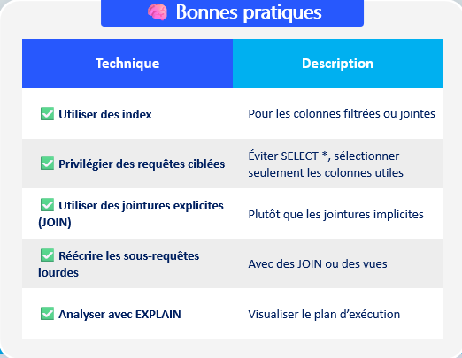

# 📑Principes d'indexations 
💡*Accélérer la recherche de données en créant des structures supplémentaires (index) pour accéder plus rapidement aux enregistrements.*

## ✅ Bonne pratiques 


## ⚠️ Anti-patterns à éviter
- ``SELECT *`` sur des tables volumineuses
- Fonctions sur des colonnes indexées : ``WHERE UPPER(nom) = 'MARTIN'`` désactive l’index
- Sous-requêtes mal placées
- Trop de jointures ou de vues imbriquées  


# 🧩 Types d'index 
- Primaire : Créé automatiquement sur la clé primaire  
- Unique : Empêche les doublons (ex : email)  
- Composite : Sur plusieurs colonnes (ex : nom + prénom)  
- Texte intégral : Pour des recherches sur des textes longs
- Bitmap : Optimisé pour des colonnes à faible cardinalité
- B-tree : Le plus courant, équilibré pour recherche/tri

## 📚 Structure d'index les plus courantes 
- B-Tree (arbre équilibré)
- Hash (table de hachage)
- Bitmap
- R-Tree (index spatial)

# 📝 Exemple de création d'index

```sql
-- Index sur une colonne 
CREATE INDEX idx_nom ON Etudiants(nom);

-- Index composite 
CREATE INDEX idx_nom_prenom ON Etudiants (nom, prenom);

-- Index unique 
CREATE UNIQUE INDEX idx_email ON Etudiants (email);

```


