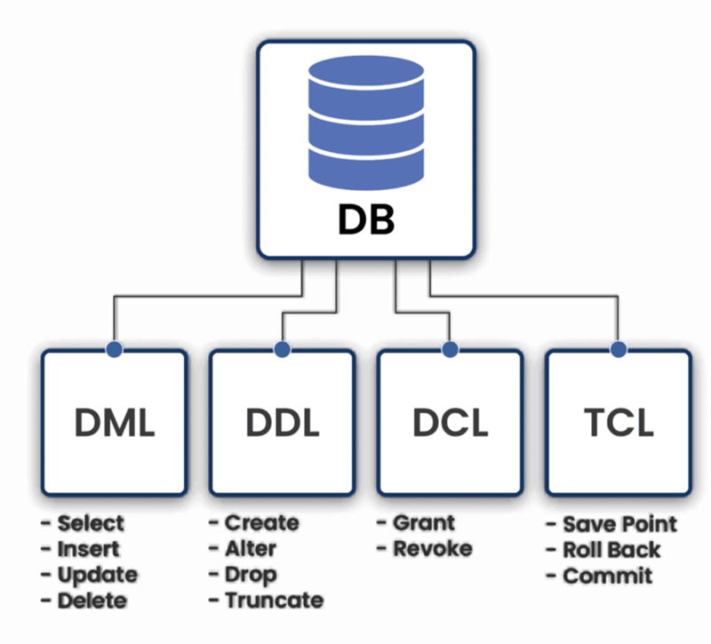

# 💬 Langages de requêtes   
💡 *Le langage de requête, qui comprend le langage de requête des bases de données, est un langage informatique spécialisé utilisé pour effectuer des requêtes et récupérer des informations dans des bases de données. Il agit comme une interface entre les utilisateurs et les bases de données.* 

## 🗄️ SQL (Structured Query Language)
SQL est le langage standard pour interagir avec les bases de données relationnelles.  

## 🏗️ DDL (Data Definition Language) 
### ⚙️ Rôle du DDL 
Le DDL permet de définir la structure logique d'une base de données, notamment :
- La création de tables avec des types de données appropriés.
- L'établissement de relations entre les tables via des clés primaires et étrangères.
- L'ajout de contraintes pour assurer l'intégrité des données.

En résumé, le DDL est essentiel pour concevoir et maintenir la structure d'une base de données relationnelle. 

### Exemple 

```sql
CREATE TABLE Etudiants (
    id_etudiant INT AUTO_INCREMENT PRIMARY KEY,
    nom VARCHAR (50) NOT NULL,
    prenom VARCHAR (50),
    date_naissance DATE,
    email VARCHAR (100) UNIQUE
)ENGINE=INNODB;
```

## ✍️ DML (Data Manipulation Language)  

### ✅ Le DML est essentiel pour : 
- Interroger les données stockées.
- Ajouter de nouvelles informations.
- Mettre à jour des enregistrements existants.
- Supprimer des données obsolètes ou incorrectes.

Ces opérations sont souvent utilisées en conjonction avec des transactions pour garantir l'intégrité des données.

### Exemple 

```sql
-- Insertion de données 
INSERT INTO Etudiants (nom,prenom, date_naissance) VALUES
('BRAUD', 'Thomas','2006-12-04')

--Sélection 
SELECT nom, prenom FROM Etudiants WHERE date_naissance > '2006-12-04';

-- Mise à jour 
UPDATE Etudiants SET email = 'thomas.braud@supdevinci-edu.fr' WHERE id_etudiant = 1;

--Suppression 
DELETE FROM Etudiants Where id_etudiant = 1;
```

## 🔐 DCL (Data Control Language)

Le DCL permet de gérer les droits et permissions des utilisateurs sur les objets d’une base de données.
- ``GRANT`` : Accorder des privilèges 
- ``REVOKE`` : Supprimer des privilèges 

### Exemples 

```sql
GRANT SELECT, INSERT ON base_etudiants. * TO 'utilisateur1'@'localhost';
REVOKE INSERT ON base_etudiants. * FROM 'utilisateur1'@'localhost';
```

## 🔄 TCL (Transaction Control Language)

Le TCL gère l’exécution des transactions afin d’assurer l’intégrité et la cohérence des données.
- ``COMMIT`` : Valider une transaction 
- ``ROLLBACK`` : Annuler une transaction 
- ``SAVEPOINT`` : Créer un point de sauvegarde dans une transaction
- ``SET TRANSACTION`` : Spécifier des caractéristiques pour la transaction

## Exemple 
```sql
BEGIN ;
UPDATE comptes SET solde = solde - 500 WHERE id_client = 1;
UPDATE comptes SET solde = solde + 500 WHERE id_client = 2;
COMMIT; 
```

## 🚀 Requêtes avancées en SQL  

### 🔗 Les jointures 

Les jointures permettent de combiner des données provenant de plusieurs tables


#### Exemple 

Cette requête retourne la liste des noms et prénoms des étudiants ainsi que les intitulés des cours auxquels ils sont inscrits, mais uniquement pour les cours valant plus de 5 crédits.

```sql
--Sélectionne les colonnes nom et prénom de la table Etudiants (alias e) et la colonne intitule de la table Cours (alias c) 
SELECT e.nom, e.prenom, c.intitule
-- Définit la table Etudiants (avec l'alias e) comme table de base 
FROM Etudiants e
--Effectue une jointure interne avec la table Inscriptions (alias i) en associant les étudiants à leurs inscriptions
JOIN Inscription i ON e.id_etudiant = i.id_etudiant
--Effectue une jointure interne avec la table Cours (alias c) en associant les inscriptions aux cours correspondants  
JOIN Cours c ON i.id_cours = c.id_cours 
--Filtre les résultats pour ne conserver que les cours valant plus de 5 crédits
WHERE c.credits > 5;
``` 


### ➕ Fonctions d'agrégations 

Les fonctions d'agrégation permettent de réaliser des calculs sur des ensembles de données.

Exemples de quelques fonctions d'agrégations : 
- ``AVG()`` pour calculer la moyenne sur un ensemble d’enregistrement 
- ``COUNT()`` pour compter le nombre d’enregistrement sur une table ou une colonne distincte
- `MAX()` pour récupérer la valeur maximum d’une colonne sur un ensemble de ligne. Cela s’applique à la fois pour des données numériques ou alphanumérique
- ``MIN()`` pour récupérer la valeur minimum de la même manière que ``MAX()``
- ``SUM()`` pour calculer la somme sur un ensemble d’enregistrement  

#### Exemple 

Cette requête retourne la liste des cours et leur nombre d'inscriptions, mais uniquement pour les cours ayant plus de 10 étudiants inscrits.

```sql
-- Sélectionne l'intitulé du cours et compte le nombre d'étudiants inscrits à ce cours (avec un alias pour la colonne calculée)
SELECT c.intitule, COUNT (id.idetudiant) AS nombre_inscrits 
-- Définit la table Cours avec l'alias c comme table de base
FROM Cours c 
-- Effectue une jointure externe gauche avec la table Inscriptions pour inclure tous les cours, même ceux sans inscription
LEFT JOIN Inscriptions i ON c.id_cours = i.id_cours
-- Regroupe les résultats par intitulé de cours pour appliquer la fonction d'agrégation sur chaque groupe
GROUP BY c.intitule
-- Filtre les groupes pour ne conserver que ceux ayant plus de 10 étudiants inscrits
HAVING COUNT (i.id_etudiannt)
```

### 📥 Sous-requêtes

Les sous-requêtes sont des requêtes imbriquées à l'intérieur d'une requête principale.

#### Exemple 

Cette requête retourne les noms et prénoms de tous les étudiants inscrits au cours dont l'identifiant est 101 (dans notre exemple, il s'agit du cours "Bases de données").


```sql
-- Requête principale qui sélectionne le nom et prénom des étudiants
SELECT nom, prenom
FROM Etudiants
-- Condition qui filtre les étudiants dont l'identifiant est présent dans l'ensemble retourné par la sous-requête
WHERE id_etudiants IN (
    -- Sous-requête qui retourne les identifiants des étudiants inscrits au cours ayant l'id 101
    SELECT id_etudiant
    FROM Inscripitons
    WHERE id_cours = 101
);
```


# 🗺️ Schéma résumé 



