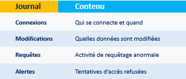

# 📘 Principes fondamentaux
Les 3 piliers de la sécurité sont souvent désignés par l’acronyme CIA :
- Confidentialité : Empêcher l'accès non autorisé
- Intégrité : Empêcher la modification non autorisée
- Authenticité : Vérifier l'identité des utilisateurs

On peut aussi ajouter : 
- Disponibilité : Assurer l’accès légitime en temps utile
- Auditabilité / Traçabilité : Suivre qui fait quoi


# 👥 Gestion des utilisateurs et des droits
```sql
-- Créer un utilisateur 
CREATE USER 'etudiant'@'localhost' IDENTIFIED BY 'mot_de_passe';

-- Accorder des droits 
GRANT SELECT, INSERT ON base_etudiants.* TO 'etudiants'@'localhost';

-- Révoquer des droits 
REVOKE INSERT ON base_etudiants.* FROM 'etudiant'@'localhost'

-- Accorder des droits 
GRANT SELECT, INSERT ON base_etudiants.* TO 'etudiant'@'localhost';

-- Révoquer des droits 
REVOKE INSERT ON base_etudiants.* FROM 'etudiant'@'localhost';
```

# 🗃️ Cache et mémoire

- DAC (Discretionary Access Control) : Contrôle basé sur l’identité et la volonté du propriétaire
- MAC (Mandatory Access Control) : Contrôle basé sur des niveaux de sécurité imposés (militaire)
- RBAC (Role-Based Access Control) : Accès basé sur des rôles attribués aux utilisateurs

## Exemple RBAC 
```sql
-- Créer un rôle 
CREATE ROLE enseignant; 

-- Accorder des droits à ce rôle
GRANT SELECT, INSERT ON notes TO enseignant;

-- Assigner le rôle à un utilisateur 
GRANT enseignant TO prof_Fort;
```

# 🔐 Chiffrement des données 

## 🛏️ Chiffrement au repos 
- Fichiers ou colonnes chiffrés dans le SGBD
- Transparent pour l'utilisateur 
  
### Exemple : 
```sql
-- Exemple mySQL avec clé maître
ALTER TABLE utilisateurs MODIFY email VARBINARY(255);
```

## 🚀 Chiffrement en transit
- Connexions sécurisées avec SSL/TLS

## 🗝️ Fonctions de hachage 
💡 *Les mots de passes ne doivent jamais être stockés en clair. On utilise donc des fonctions de hachage (ex ; SHA-256, bcrypt).*

### Exemple 
```sql
-- Enregistrement d'un mot de passe haché 
INSERT INTO utilisateur (login, hash_pwd) VALUES ('paul', SHA2 ('mot2passe',256))
```

# 🕵️‍♂️ Audit et journalisation 

## 📘 Principes fondamentaux 

Suivi des activités critiques dans la base : 



Outils : MySQL Audit Plugin, pgAudit (PostgreSQL)

# 🗄️ Administration des bases de données 

## 🛠️ Installation et configuration 

Étapes typiques de l’installation :  

- Choix du SGBD : Choisir un SGBD (par exemple, MySQL, PostgreSQL, Oracle, SQL Server) en fonction des besoins de l'entreprise (volumes de données, performances, exigences de sécurité).  

- Installation : Installation du logiciel sur des serveurs ou dans des environnements cloud.
Configuration initiale : Paramétrage de la base de données (taille des buffers, nombre de connexions simultanées, optimisations pour les requêtes, etc.).  

- Sécurité : Mise en place des règles de sécurité comme le chiffrement, l'accès restreint, la gestion des utilisateurs, et l'authentification forte.  
 
- Tests : Effectuer des tests de performances et de charge avant le déploiement complet

## 💾 Sauvegarde et restauration 

### 🗂️ Types de sauvegarde :  

- Sauvegarde complète : Sauvegarde de toutes les données. Cela prend plus de temps et d'espace mais permet une restauration rapide.  
  
- Sauvegarde incrémentielle : Sauvegarde uniquement des données modifiées depuis la dernière sauvegarde, ce qui économise de l'espace et du temps.  

- Sauvegarde différentielle : Sauvegarde des données modifiées depuis la dernière sauvegarde complète, offrant un compromis entre sauvegarde complète et incrémentielle.  

### 🧠 Stratégies de sauvegarde :  

- Sauvegardes régulières et automatiques : Planifier des sauvegardes régulières à intervalles spécifiques.  
  
- Sauvegarde hors site : Stockage des sauvegardes dans des emplacements distants (cloud ou serveurs externes) pour garantir la protection en cas de désastre local.  

- Redondance : Utilisation de plusieurs copies de sauvegarde (ex. : sur disque et sur cloud) pour plus de sécurité

### 🔄 Restauration 

- Test de la procédure de restauration pour vérifer la validités des sauvegardes  
  
- Stratégies de restauration rapides en cas de défaillance du système

## 🔍 Surveillance et maintenance 

### 👁️ Surveillance :  

- Performance : Surveillance des temps de réponse des requêtes, de la charge CPU, de l'utilisation de la mémoire, et des performances des disques.  
  
- Alertes : Mise en place d’alertes pour détecter les erreurs, les surcharges, ou les comportements inhabituels des bases de données.  

- Logs : Surveillance des journaux d’événements pour détecter d’éventuelles erreurs ou tentatives d'accès non autorisées. 


### 🧰 Maintenance : 

- Mise à jour régulière des SGBD : Pour corriger les failles de sécurité, améliorer les performances, ou ajouter de nouvelles fonctionnalités

- Optimisation des requêtes : Identifier et optimiser les requêtes lentes

- Gestion des index : Créer et optimiser des index pour améliorer la vitesse des requêtes
  
- Purge des anciennes données : Supprimer les données obsolètes pour libérer de l'espace disque


## 📈 Mise à l'échelle et haute disponibilité

### 📏 Mise à l'échelle : 

- Mise à l'échelle verticale (scale-up) : Augmenter les ressources d'un serveur (plus de RAM, plus de CPU, plus de stockage)  


- Mise à l'échelle horizontale (scale-out) : Ajouter des serveurs supplémentaires pour répartir la charge et améliorer les performances

### 🏛️ Stratégies spécifiques pour la haute disponibilité :  

- Failover automatique : En cas de panne du serveur principal, un autre serveur prend le relais pour minimiser l'impact


- Load balancing : Répartition de la charge entre plusieurs serveurs pour éviter les goulots d'étranglement
